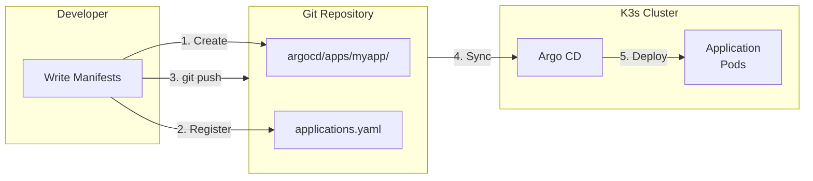
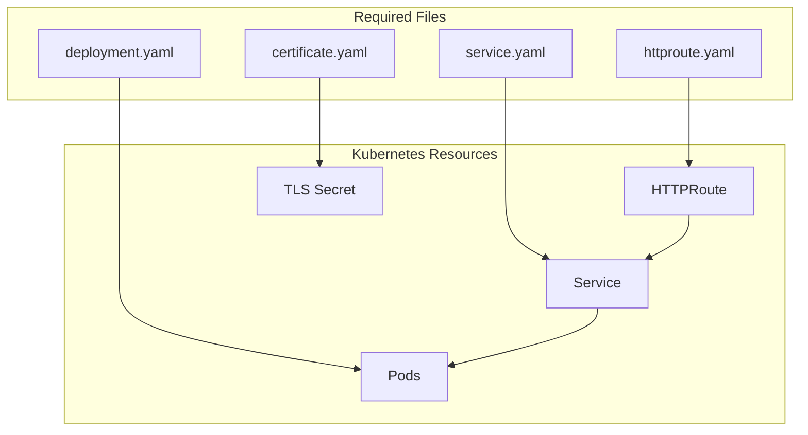

This cluster uses GitOps. Applications are deployed by committing manifests to the repository.



## Workflow

1. Create a directory in `argocd/apps/<app-name>/`
2. Add Deployment, Service, and HTTPRoute manifests
3. Register the application in `argocd/applications.yaml`
4. Commit and push



## Adding via Terraform

Since `argocd/applications.yaml` is generated by Terraform:

1. Add manifests to `tf-k3s/templates/manifests/<app-name>/`
2. Update `tf-k3s/templates/manifests/applications.yaml.tpl`
3. Update `tf-k3s/manifests.tf`
4. Run `terraform apply`
5. Commit and push

## Adding via Git

Edit `argocd/applications.yaml` directly. Note that running `terraform apply` later may overwrite this file.

## Exposing via Gateway API

Create an HTTPRoute to expose the application:

```yaml
apiVersion: gateway.networking.k8s.io/v1
kind: HTTPRoute
metadata:
  name: my-app-route
  namespace: default
  annotations:
    external-dns.alpha.kubernetes.io/target: "<ingress-public-ip>"
spec:
  parentRefs:
    - name: docs-gateway
  hostnames:
    - "myapp.example.com"
  rules:
    - backendRefs:
        - name: my-app-service
          port: 80
```

The `external-dns.alpha.kubernetes.io/target` annotation is required for External DNS to create the correct A record.

## TLS Certificate

Add a Certificate resource for HTTPS:

```yaml
apiVersion: cert-manager.io/v1
kind: Certificate
metadata:
  name: my-app-tls
  namespace: default
spec:
  secretName: my-app-tls
  issuerRef:
    name: cloudflare-issuer
    kind: ClusterIssuer
  dnsNames:
    - "myapp.example.com"
```

Reference the secret in the Gateway listener configuration.
